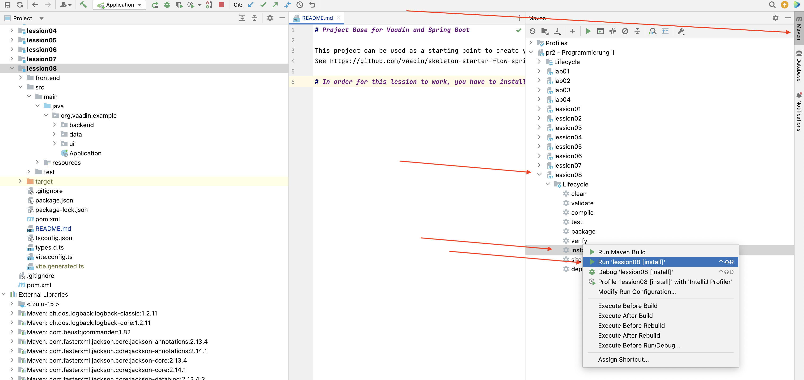

# Project Base for Vaadin and Spring Boot

This project can be used as a starting point to create your own Vaadin application with Spring Boot. 
See https://github.com/vaadin/skeleton-starter-flow-spring

# Steps to follow

Yu first have to run `maven install` for this lession to work. 

Afterwards, you have run/execute the class `de.bht.pr2.lession08.Application`.